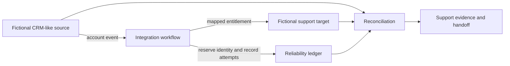
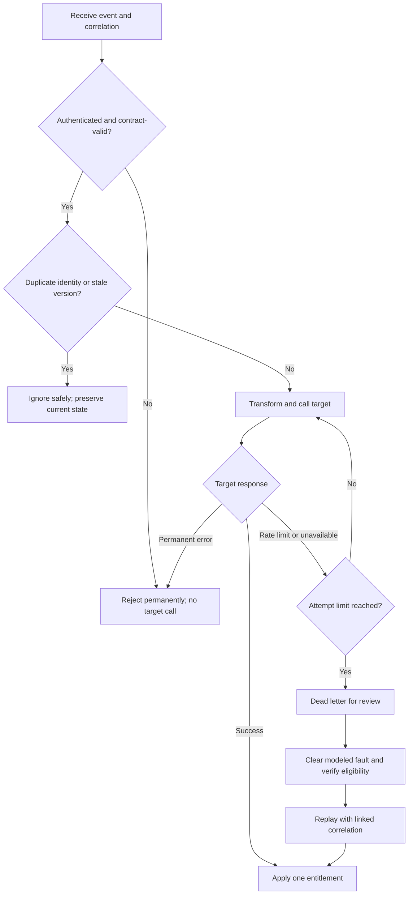
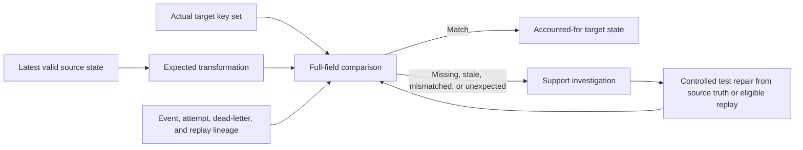

# SaaS Integration Reliability & Support Troubleshooting

> **SYNTHETIC LOCAL INTEGRATION DEMO — NOT A REAL CLIENT OR PRODUCTION INTEGRATION**

A fictional CRM-like source owns account status, contract state, support tier, region, and product family. A fictional support system needs a dependable entitlement record that answers a practical question: what support coverage should this account receive now, and why?

The work focuses on the analysis between those systems. It turns two data contracts into explicit mapping rules, makes failure behavior observable, and gives support staff a repeatable way to distinguish a bad request from a transient dependency problem or a state mismatch. All services, records, failures, and results are local and synthetic.

## Source-to-target architecture

**Text alternative:** A fictional account event moves from the source through an integration workflow to the support-entitlement target. The workflow records identity and attempt history in a reliability ledger. Reconciliation compares source, target, and ledger state, then provides a single evidence path for support handoff.

The source contract requires a stable event identity and version alongside account, tier, contract, region, product, and event-time fields. The target contract keeps the resulting entitlement status and priority, normalized coverage and product scope, the source version that justified the state, and correlation lineage for investigation.

## Mapping decisions that can be explained

The transformation is intentionally rule-driven:

- suspended or closed accounts, and accounts with expired contracts, map to disabled support;
- active accounts with current contracts map to enabled support;
- active accounts with pending contracts map to pending support;
- standard, priority, and premium tiers map to normal, high, and urgent support priority;
- allowed regions pass through; and
- product family is trimmed, uppercased, and normalized to a stable underscore format.

Precedence matters. A premium tier does not override a suspended account, and an apparently well-formed event does not override a newer target version. Unsupported values are rejected rather than guessed. These decisions make behavior reviewable by technical and business stakeholders without relying on code as the explanation.

## Reliability decision flow

**Text alternative:** Authentication and contract failures stop before the target and do not retry. Valid events are screened for duplicate identity and stale version. New events are transformed and delivered once; only modeled rate-limit and service-unavailable responses retry within a fixed cap. Exhausted transient failures enter dead letter and may be replayed after review, while permanent failures remain rejected.

Idempotency protects the target when the same event is delivered twice. Event ordering protects newer state when an older or equal version arrives later. Together they prevent duplicate target records and stale updates that appear successful but silently reverse current state.

Retry policy is narrow by design. A temporary rate limit or unavailable target may recover within the bounded attempt sequence. Authentication, schema, required-field, and enum failures cannot improve through repetition, so they fail permanently with specific evidence. When transient delivery exhausts, the preserved event enters dead letter rather than disappearing or retrying indefinitely.

Replay is controlled recovery, not a second business event. It keeps the original event identity, creates a linked correlation trail for the recovery attempt, and checks eligibility before delivery. That lets support staff explain both what originally failed and how the recovered target state relates to the same source event.

## Evidence and reconciliation path

**Text alternative:** Reconciliation calculates the expected entitlement from the latest valid source state and compares it with every relevant target field and key. Event and attempt lineage explains how the target reached its state. A match closes the comparison; missing, stale, mismatched, or unexpected state opens a support investigation followed by either a controlled test-only repair from source truth or an eligible replay and a new comparison.

Reconciliation is more than a row-count check. It compares the latest valid source record, the deterministic expected transformation, and the complete target key set. The classifications distinguish a missing target from stale state, a field-level mismatch, or an unexpected target record. That distinction drives the next safe action and prevents an unexplained target edit from hiding the cause.

The support handoff joins the same evidence used during execution: correlation, event and version, mapping decision, target attempts, terminal disposition, dead-letter or replay lineage, and final reconciliation. The runbook routes common symptoms through inspection, classification, safe action, escalation, and closure evidence. Three synthetic walkthroughs cover authentication rejection, exhausted service unavailability with replay, and a detected field mismatch repaired from the latest valid source state through an explicit test-only path.

## What this work demonstrates

This work sample adds system-to-system analysis and troubleshooting proof: executable API communication, contract mapping, transformation precedence, idempotency, event ordering, bounded retries, dead-letter recovery, correlation lineage, and full-state reconciliation. The emphasis is integration and support judgment, not a software-engineering identity.

## Limitations

The source and target are local mocks using fictional, non-personal data. Authentication is a local test assumption, not a production security design. Failure recovery and reconciliation show deterministic behavior in a controlled exercise; they do not establish client delivery, production reliability, service-level performance, scale, adoption, savings, or business impact. Execution uses the Python reference orchestrator. The separate n8n workflow is an unexecuted structural draft and is not evidence of n8n proficiency.

