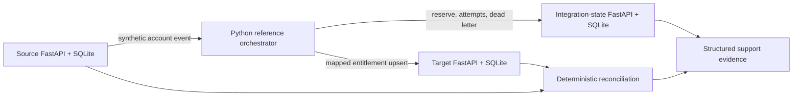
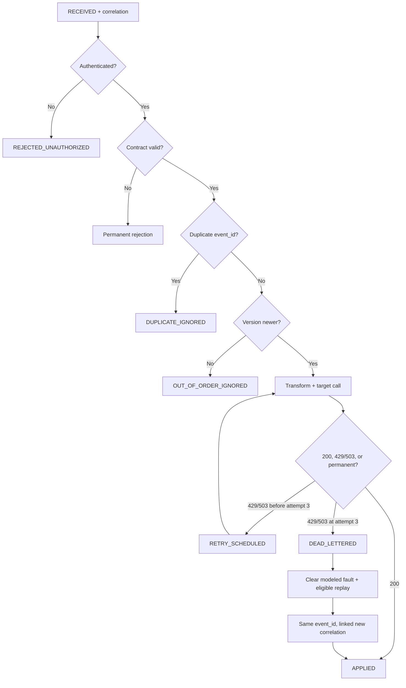

# Scenario, architecture, and reliability model

## Scenario

A fictional CRM-like source owns account status, support tier, contract state, region, and product family. A fictional support-entitlement target retains mapped eligibility, priority, coverage, scope, source version, correlation, event lineage, and a synthetic update label.

All records use fictional identifiers such as `ACCOUNT-1001`, `EVENT-0001`, and `TRACE-0001`. No names, contacts, organizations, subscriptions, or credentials are used.

## Local architecture

**Text alternative:** The source sends a fictional account event to the Python reference orchestrator. The orchestrator consults the integration-state ledger, writes a mapped entitlement to the target, and combines source, target, and ledger evidence for reconciliation and support.

## Source contract

Required fields are `event_id`, `event_version`, `event_type`, `account_id`, `account_status`, `support_tier`, `region`, `product_family`, `contract_state`, and `occurred_at`.

Allowed values:

- event type: `account.created`, `account.updated`, `account.suspended`;
- account status: `Active`, `Suspended`, `Closed`;
- support tier: `Standard`, `Priority`, `Premium`;
- contract state: `Current`, `Pending`, `Expired`; and
- region: `NorthAmerica`, `Europe`, `AsiaPacific`.

## Target contract and precedence

The target retains `account_id`, `entitlement_status`, `support_priority`, `coverage_region`, `product_scope`, `source_version`, `correlation_id`, `last_event_id`, and `updated_at`.

1. `Suspended`, `Closed`, or `Expired` maps to `DISABLED`.
2. Otherwise, `Active + Current` maps to `ENABLED`.
3. Otherwise, `Active + Pending` maps to `PENDING`.

Support priority maps `Standard → Normal`, `Priority → High`, and `Premium → Urgent`. Region passes through its allowed value. Product family is trimmed, uppercased, and normalized to underscores; an empty, oversized, or invalid result is permanently rejected.

## Reliability state model

**Text alternative:** Authentication and contract checks fail permanently without target calls. Valid events are checked for duplicate identity and newer version, then transformed and delivered. Only modeled 429 and 503 responses retry, for no more than three target calls. Exhausted events enter dead letter and can be replayed only after the fault clears, retaining event and correlation lineage.

## Reconciliation and controlled repair

Reconciliation compares the latest valid source record, its expected target transformation, and the complete actual target key set. Classifications are `MATCH`, `MISSING_TARGET`, `STALE_TARGET`, `FIELD_MISMATCH`, and `UNEXPECTED_TARGET`. The deterministic synthetic sequence produces three matches and zero exceptions.

The mismatch scenario deliberately alters one target field, preserves the mismatch evidence, derives the expected target state from the latest valid source record, and uses an explicit test-only repair endpoint. It retains the existing source version and last event identity; it does not invent a higher-version source event or represent a normal production correction path.

## Runtime decision

The executable authority is the Python reference orchestrator. n8n runtime execution was deferred, and the included n8n JSON is unexecuted structural design evidence only.

